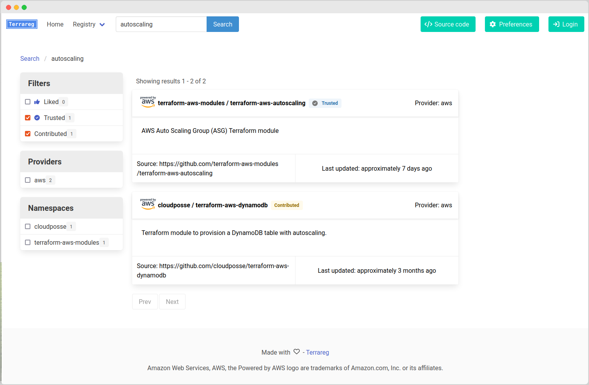

# Terrareg

Open source Terraform Registry.

Provides features to aid usage and discovery of modules, providing:

 * Fully implemented Terraform modules API
 * Completely API driven for automating all features
 * Host Terraform modules internally or from an exteral Git source
 * Analytics about the usage of modules
 * All information about a module - README, inputs, outputs, provider requirements and managed resources
 * Security alerts for each module, submodule and examples
 * Cost estimation for each module example
 * Module example source code within the UI, with automatic rewriting of 'source' arguments
 * Interactive 'Usage builder', helping users build terraform to use the terraform modules
 * Hooks for git SCM applications to automatically index modules
 * Authentication via SSO (OpenIDConnect/SAML2)

If you like and use this project and are happy to let us know, please raise a Github issue, create a PR or contact [MatthewJohn](https://github.com/matthewjohn) so it can be added to the README :)

For a full list of issues and pull requests, please see [https://gitlab.dockstudios.co.uk/pub/terrareg](https://gitlab.dockstudios.co.uk/pub/terrareg)

## Screenshots





## Getting started


    # Clone the repository
    git clone https://github.com/matthewJohn/terrareg
    cd terrareg

    # Builder docker image
    docker build . -t terrareg:latest

    # Create secret key for session data
    export SECRET_KEY=$(python -c 'import secrets; print(secrets.token_hex())')

    # Run container, specifying secret key and admin password
    docker run -ti -p 5000:5000 -e PUBLIC_URL=http://localhost:5000 -e MIGRATE_DATABASE=True -e SECRET_KEY=$SECRET_KEY -e ADMIN_AUTHENTICATION_TOKEN=MySuperSecretPassword terrareg:latest

The site can be accessed at http://localhost:5000, which will provide a 'Initial Setup' guide for getting started.

For information about running with docker-compose, SSL certificate generation or running without docker, see [docs/LOCAL_DEVELOPMENT.md](./docs/LOCAL_DEVELOPMENT.md).

## Upload a terraform module:

### From a git repo


* Goto http://localhost:5000
* Login, using the button in the top-right hand corner
* Goto 'Create' -> 'Namespace' (http://localhost:5000/create-namespace)
  * Provide a name for the namespace and create.
* Goto 'Create' -> 'Modules' (http://localhost:5000/create-module)
* Fill in the details for your module and 'Create'
* Use the 'Manually index version' form of your module, filling out the verison and select 'Publish' and then press 'Index Version'

### From source

    terrareg_root=$PWD
    
    cd source/of/my/module
    
    # OPTIONAL: Create an terrareg meta-data file
    echo '{ "description": "My first module", "owner": "ME!", "source": "https://github.com/me/my-tf-module" }' > ./terrareg.json
    
    # Zip up module
    zip -r ../my-tf-module.zip *
    
    # Upload to terrareg
    bash $terrareg_root/scripts/upload_module.sh http://localhost:5000 helloworld my-tf-module aws 1.0.0 ../my-tf-module.zip

  Navigate to http://localhost:5000 to get started, or http://localhost/modules/helloworld/my-tf-module to see the uploaded example!


**NOTE:** To use modules from the registry in Terraform, a valid SSL certificate must be used. Terraform will not work if you supply `http://` as a protocol for the module URL, as it will treat this as a direct HTTP download, rather than treating it as a registry.


## Additional configuration

For a full list of environment variables, please see [Deployment Guide](./docs/USER_GUIDE.md#deployment) and [docs/CONFIG.md](./docs/CONFIG.md)

## User Guide

See the [User Guide](./docs/USER_GUIDE.md) for configuring and using Terrareg features.

## API Documentation

See the [API Docs](./docs/API.md) for a list of all API endpoint.

## Changelog

See [CHANGELOG.md](CHANGELOG.md)


## Local development

Since terraform requires HTTPS with a valid SSL cert, this must be provided in local development

On linux, by default, non-privileged users cannot listen on privileged ports, so the following can be used to route requests locally to port 5000:

```
sudo iptables -t nat -I OUTPUT -p tcp -d 127.0.0.1 --dport 443 -j REDIRECT --to-ports 5000
```

Example to run in local development environment:
```
virtualenv -ppython3.8 venv
. venv/bin/activate
pip install -r requirements.txt
pip install -r requirements-dev.txt

# Without SSL cert
PUBLIC_URL=http://localhost:5000 ALLOW_CUSTOM_GIT_URL_MODULE_PROVIDER=False ALLOW_CUSTOM_GIT_URL_MODULE_VERSION=False GIT_PROVIDER_CONFIG='[{"name": "Github", "base_url": "https://github.com/{namespace}/{module}", "clone_url": "ssh://git@github.com/{namespace}/{module}.git", "browse_url": "https://github.com/{namespace}/{module}/tree/{tag}/{path}"}, {"name": "Bitbucket", "base_url": "https://bitbucket.org/{namespace}/{module}", "clone_url": "ssh://git@bitbucket.org/{namespace}/{module}-{provider}.git", "browse_url": "https://bitbucket.org/{namespace}/{module}-{provider}/src/{tag}/{path}"}, {"name": "Gitlab", "base_url": "https://gitlab.com/{namespace}/{module}", "clone_url": "ssh://git@gitlab.com/{namespace}/{module}-{provider}.git", "browse_url": "https://gitlab.com/{namespace}/{module}-{provider}/-/tree/{tag}/{path}"}]' SECRET_KEY=ec9b8cc5ed0404acb3983b7836844d828728c22c28ecbed9095edef9b7489e85 ADMIN_AUTHENTICATION_TOKEN=password ANALYTICS_AUTH_KEYS=xxxxxx.atlasv1.zzzzzzzzzzzzz:dev,xxxxxx.atlasv1.xxxxxxxxxx:prod VERIFIED_MODULE_NAMESPACES=hashicorp TRUSTED_NAMESPACES=test DEBUG=True AUTO_PUBLISH_MODULE_VERSIONS=False LISTEN_PORT=5001 python ./terrareg.py

# With SSL Cert
# Add the following argument
#  --ssl-cert-private-key ./example/ssl-certs/private.pem --ssl-cert-public-key ./example/ssl-certs/public.pem

```

## Generating DB changes

```
alembic revision --autogenerate
```

## Applying DB changes

```
alembic upgrade head
```

## Running tests

```
# Run all tests
pytest

# Running unit/integration/selenium tests individually
pytest ./test/unit
pytest ./test/integration
pytest ./test/selenium

# Running a specific test
pytest -k test_setup_page
```

## Committing

All commits should use angular-style commit messages: https://www.conventionalcommits.org/en/v1.0.0/.

Generally, the only exception around not having a 'type: ' prefix is whilst fixing an issue caused by a previous commit in a branch (i.e. a bug that didn't reach the main branch without the fix).

A Gitlab issue must be included at the bottom of the commit message `Issue #123`.

This format is important for the CI to perform releases and update release notes accurately.

If there isn't a gitlab issue for the task that you are working on, please feel free to ask for one (raise a Github issue and maintainer can rcreate an issue for you. Alternatively, request access to Gitlab, which should be granted)


# License

This project and all associated code is covered by GNU General Public License v3.0.

For full license, see [LICENSE](LICENSE)

# Contributors

 * Matt Comben <matthew@dockstudios.co.uk>
 * Michael Holt <mike@holtit.com>

## Special thanks

 * David Soff <david@soff.nl> for implementing Github hook support
 * @0xken for impleenting a custom Cherry Dark theme
 * @chriscunningham-trivago for fixing tfswitch bug in docker build
 * @bmaximuml for fixing typos

